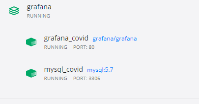
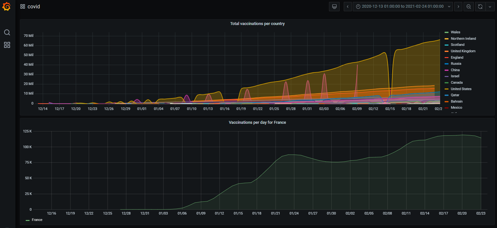

# Un conteneur pour grafana

Ce projet réalisé en binôme a pour but de développer sur un serveur Linux un dashboard Grafana proposant des graphiques sur la vaccination de la Covid-19 dans le monde.

## Traitement des données
Pour commencer nous avons traité les données mises à notre disposition:
* Suppression des colonnes qui ne nous semblaient pas "utilent" pour les graph que l'on voulait faire permettant ainsi d'alléger le fichier
    * iso_code : code du pays
    * id_vac : id de l'entrée dans la database
    * source_name : la source des données (ministère de la santé, agence gouvernementale, ... ) 
    * source_website : le site internet où l'on trouve l'information
* Le remplacement des valeurs NAN par des 0 pour une meilleure intégration 
* Convertion du fichier .csv et .sql

## Installation 

Dans un premier temps, installer Docker Desktop [lien](https://www.docker.com/products/docker-desktop)

Les installations de Grafana et MySql  se font via Docker.

## Création du docker-compose

Pour faciliter la mise en place des containers , nous avons utilisé un fichier [docker-compose](/docker-compose.yml) qui contiendra les information nécessaires à leur création.

Ce fichier peut être lancé dans l'invit de commande avec un ``cd PATH`` pour se placer dans le même dossier que le docker-compose puis avec ``docker-compose up -d``

Cela va permettre de créer les 2 containers pour **MySQL** et **Grafana** et de les lancer.  

On peut vérifier que les containers sont bien lancés avec la commande ``docker ps``

## MySQL

Au lancement du docker-compose, le fichier SQL contenant les données est stoqué dans le dossier ``docker-entrypoint-initdb.d`` grâce au volume.

## Grafana

On va suivre le même principe pour Grafana. On va créer 2 volumes. Ils vont utiliser les dossiers:

* **dashboard** qui contient 2 fichiers: 
   * [dashboard.json](dashboards/dashboard.json) qui contient les informations pour les graph affichés
   * [dashboard.yml](dashboards/dashboard.yml) qui contient les informations nécessaires à la création des dashboard

* **datasource** qui contient 1 fichier:
   * [automatic.yml](datasources/automatic.yml) qui renseigne les informations nécessaires à la connexion à la base de données MySQL.

## Accès à Grafana

L'accès à Grafana se fait en écrivant dans la barre d'url ``localhost:80``.  
Ensuite il y aura 2 possibilités en fonction des réglages:
* connexion normale demandant de renseigner le ``user`` et le ``password`` qui sont *admin* par défaut 

* connexion en mode viewer qui ne permet aucun changements et ne permet d'avoir accès qu'aux dashboards.

Dans notre cas, il s'agit de la deuxième option. Nous avons choisi de faire 2 [dashboards](http://localhost:80)
   * vaccination totale par pays
   * vaccination par jours en France

